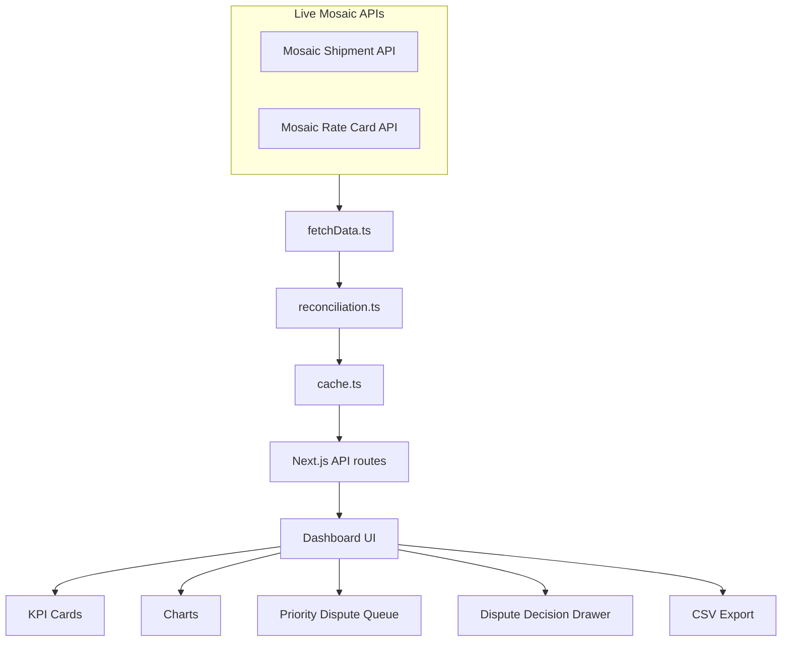

# Architecture

## Project Purpose

Mosaic Logistics Billing Auditor is a supply-chain recovery tool for carrier billing audit. It performs rate-card reconciliation, identifies recoverable overbilling, and creates a dispute-ready queue for carrier follow-up. The goal is not only to report billing issues, but to help the supply chain team decide which carrier invoices to dispute first.

## Data Sources

- Mosaic Shipments API: shipment records, billed amounts, billed zones, billed slabs, COD/RTO/misc charges, and delivery status.
- Mosaic Rate Card API: contracted carrier rates by carrier, destination zone, and weight slab, plus COD fee and RTO multiplier.

The app fetches live API data at runtime. It does not use bundled sample data or hardcoded dashboard totals.

## File And Folder Structure

```text
frontend/
  app/
    api/
      audit/route.ts      Full reconciled audit response for the dashboard
      summary/route.ts    Summary-only API response
      issues/route.ts     Paginated overbilling issue API
      export/route.ts     Filtered CSV export API
      cron/route.ts       Optional manual cache warming endpoint
    components/
      DashboardClient.tsx Main dashboard UI
      types.ts            Shared dashboard response types
  lib/
    fetchData.ts          Live Mosaic API pagination
    reconciliation.ts     Core rate-card reconciliation and summaries
    cache.ts              In-memory/optional Redis audit cache
    exportCsv.ts          Dispute CSV creation
    formatters.ts         Currency, number, and percent formatting
```

Backend logic runs through Next.js API routes. There is no separate Express service or standalone backend process.

## System Flow



## Core Reconciliation Logic

The audit matches each shipment to the rate card using:

- Carrier
- Destination zone
- Actual weight slab

Expected charge is:

```text
Expected Charge = Contracted Base Rate + Eligible COD + Eligible RTO
```

Overcharge is:

```text
Overcharge = Total Billed - Expected Charge
```

Only positive overcharge is counted as recoverable overbilling. Underbilled or discounted shipments are tracked separately and excluded from recoverable leakage.

Affected shipments are unique overbilled shipments. Violation events are root-cause issues counted separately, so one shipment can contribute more than one violation event.

## API Routes

- `/api/audit`: returns the full reconciled result for the dashboard.
- `/api/summary`: returns summary, carrier, violation-type, and filter metadata.
- `/api/issues`: returns paginated dispute-ready overbilling rows.
- `/api/export`: returns a CSV of filtered overbilling rows.
- `/api/cron`: optional manual cache-warming endpoint. The app works without scheduled cron jobs because `/api/audit` loads and reconciles data on demand.

## Dashboard Sections

- Executive KPI cards
- Spend Context
- Carrier-wise Recoverable Overbilling
- Root Cause Breakdown
- Financial Impact by Root Cause
- Smart Audit Summary
- Priority Dispute Queue
- Dispute Decision Drawer
- Export Dispute CSV
- Filters for carrier, violation type, zone, payment mode, delivery status, shipment ID, and AWB

## Key Business Outputs

- Recoverable overbilling amount
- Affected overbilled shipments
- Root-cause violation events
- Worst carrier by leakage
- Highest financial-impact issue
- Priority dispute queue for carrier follow-up
- Exportable dispute CSV

## Assumptions

- The Mosaic rate card is the contract source of truth.
- Shipment `total_billed` is the invoice amount to compare against expected charge.
- Missing rate-card matches are flagged for review and excluded from recoverable overbilling.
- Findings are potential overbilling until a carrier accepts the dispute.

## Limitations

- The app depends on the public Mosaic APIs being reachable at runtime.
- It uses the fields available in the challenge API and does not infer hidden carrier contract terms.
- It does not replace operational approval; it prepares evidence for carrier billing review.

## Final Verified Numbers

These numbers are calculated from the live Mosaic APIs at runtime and are not hardcoded.

| Metric | Value |
|---|---:|
| Total Shipments Audited | 8,000 |
| Recoverable Overbilling | ₹14,438.07 |
| Affected Overbilled Shipments | 212 |
| Violation Events | 215 |
| Underbilled / Discounted Shipments | 22 |
| Worst Carrier by Leakage | BlueDart |
| Most Common Issue | Weight Slab Mismatch |
| Highest Financial Impact Issue | RTO/Return Charge Mismatch |
