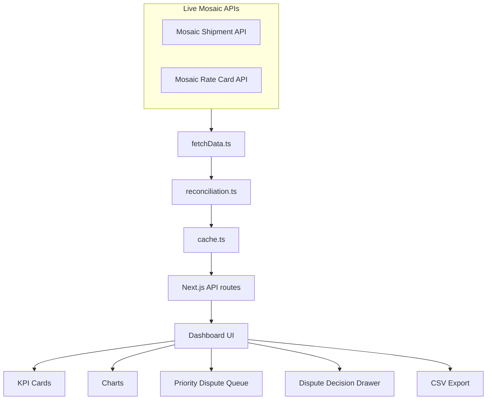

# Mosaic Logistics Billing Auditor

A dispute-ready logistics billing reconciliation tool that detects recoverable carrier overbilling by comparing live shipment bills against contracted rate cards.

Built for the Mosaic Fellowship Builder Challenge problem: Supply Chain Team - Logistics Billing Auditor.

## Quick Links

- Live Demo: **TO BE ADDED AFTER DEPLOYMENT**
- Loom Walkthrough: **TO BE ADDED AFTER RECORDING**
- Methodology: [./METHODOLOGY.md](./METHODOLOGY.md)
- Architecture: [./ARCHITECTURE.md](./ARCHITECTURE.md)
- Source Code: This repository

## Final Verified Numbers

These numbers are calculated from the live Mosaic APIs at runtime and are not hardcoded.

| Metric | Value |
|---|---:|
| Total Shipments Audited | 8,000 |
| Recoverable Overbilling | ₹14,438.07 |
| Affected Overbilled Shipments | 212 |
| Violation Events | 215 |
| Underbilled / Discounted Shipments | 22 |
| Worst Carrier by Leakage | BlueDart |
| Most Common Issue | Weight Slab Mismatch |
| Highest Financial Impact Issue | RTO/Return Charge Mismatch |

## Why This Matters

Logistics teams often receive carrier invoices where the billed amount does not match the contracted rate card. Manually checking thousands of shipments is slow and error-prone. This tool automates the reconciliation process, identifies recoverable overbilling, explains the root cause, and creates a dispute-ready queue for carrier follow-up.

## What The App Does

- Fetches live shipment and rate-card data from Mosaic APIs.
- Matches each shipment to the correct contracted rate.
- Calculates expected charge and compares it with billed charge.
- Flags only positive overcharges as recoverable leakage.
- Classifies root causes such as weight slab mismatch, zone mismatch, COD mismatch, RTO mismatch, and extra/misc charges.
- Ranks carriers by recoverable overbilling.
- Provides a Priority Dispute Queue and CSV export for action.

## How to Review This Project in 60 Seconds

1. Open the live demo.
2. Check the KPI row for recoverable overbilling.
3. Review the Priority Dispute Queue sorted by highest overcharge.
4. Click any overbilled shipment to view the Dispute Decision drawer.
5. Filter by carrier or violation type to inspect patterns.
6. Export the Dispute CSV for carrier follow-up.

## Project Flow



## Dashboard Features

- Executive KPI cards
- Spend Context
- Carrier-wise Recoverable Overbilling
- Root Cause Breakdown
- Financial Impact by Root Cause
- Smart Audit Summary
- Priority Dispute Queue
- Dispute Decision Drawer
- Export Dispute CSV
- Filters by carrier, violation type, zone, payment mode, delivery status, shipment ID, and AWB

## What Makes This More Than a Dashboard

This project is designed as a supply-chain recovery tool, not a passive reporting view.

It:

- Calculates expected charge from the contracted rate card
- Separates general mismatches from actual recoverable overbilling
- Ranks carriers by leakage
- Explains root causes
- Creates a Priority Dispute Queue
- Provides shipment-level dispute decisions
- Exports dispute-ready rows for carrier follow-up

## Methodology Summary

```text
Expected Charge = Contracted Base Rate + Eligible COD + Eligible RTO
Overcharge = Total Billed - Expected Charge
```

Only positive overcharges are counted as recoverable overbilling.

- Affected shipments are unique overbilled shipments.
- Violation events are root-cause issues counted separately.
- One shipment can have more than one violation.
- Underbilled/discounted shipments are excluded from recoverable leakage.

## Tech Stack

| Area | Technology |
|---|---|
| Framework | Next.js App Router |
| Language | TypeScript |
| UI | React |
| Charts | Recharts |
| Currency Math | decimal.js |
| API Layer | Next.js API Routes |
| Cache | In-memory cache, optional Upstash Redis |
| Deployment | Vercel / Netlify / Cloudflare Pages |

## Evaluation Criteria Mapping

| Criteria | How This Project Addresses It |
|---|---|
| Discovery | Identifies hidden overbilling patterns such as weight slab mismatch, zone mismatch, RTO/COD issues, and extra charges |
| System Quality | Provides a fast Next.js dashboard with filters, charts, dispute queue, drawer, and CSV export |
| Analytical Rigor | Uses rate-card matching, expected-vs-billed comparison, positive overcharge logic, and separate shipment/event counts |
| Loom Readiness | The app follows a clear story: find leakage, explain why it happened, and show what to dispute first |

## Submission Write-up

Logistics bills were higher than expected, so this dashboard checks whether carriers billed more than the contracted rate card. It gives the supply chain team a dispute-ready view of where money can be recovered and why the billing leakage happened.

The app fetches live shipment and rate-card data from the Mosaic APIs. It matches every shipment to the correct contract row using carrier, destination zone, and actual weight slab, calculates the expected billing amount, compares it with the shipment's `total_billed` amount, and flags only positive overcharges as recoverable leakage. Underbilled or discounted shipments are tracked separately and are not included in recovery totals.

Key findings: 8,000 shipments were audited, with ₹14,438.07 in recoverable overbilling across 212 affected overbilled shipments and 215 root-cause violation events. BlueDart had the highest recoverable leakage. Weight slab mismatch was the most common issue, while RTO/return charge mismatch had the highest financial impact.

Recommended actions are to audit BlueDart first, prioritize high-value rows from the Priority Dispute Queue, review weight slab mapping with carriers, block invalid RTO/COD/misc charges before invoice approval, and export the dispute CSV for carrier follow-up.

## Implementation Notes

- The app fetches all paginated shipment and rate-card records with `limit=100`.
- Dashboard figures are calculated from live Mosaic APIs at runtime, not from bundled sample data or hardcoded dashboard totals.
- Backend logic runs through Next.js API routes in `frontend/app/api`.
- There is no separate Express service, background server, or standalone backend process.
- The app does not use Streamlit, Render, login-gated pages, or a separate backend deployment.

## Run Locally

```bash
npm install
npm run dev
```

Open `http://localhost:3000`.

Production build:

```bash
npm run build
```

The root `postinstall` script installs the `frontend` package automatically, so a clean clone can run the documented commands without entering subdirectories.

## Deployment

- Vercel: import the repository, keep the root directory at the repo root, and use the default `npm run build` command.
- Netlify: use the Next.js runtime/plugin with `npm run build`; the app does not need authentication or a separate backend process.
- Cloudflare Pages: deploy with the platform's Next.js adapter/OpenNext flow for App Router API routes.

## Assumptions And Limitations

- The public Mosaic APIs are the source of truth and must be reachable at runtime.
- Rate-card matching uses the fields available in the API: carrier, zone, and weight slab. Service type and payment mode are used for optional charge logic where applicable.
- The app labels findings as potential overbilling because final recovery depends on business validation and carrier dispute acceptance.
- Missing rate-card matches are marked Rate Card Match Missing and excluded from potential overbilling until the contract row is available.
- Recovery counts focus only on positive overcharge rows. Underbilled or discounted rows are tracked separately and excluded from recoverable leakage.

## Folder Structure

```text
.
├── .env.example
├── .gitignore
├── ARCHITECTURE.md
├── METHODOLOGY.md
├── README.md
├── package.json
└── frontend/
    ├── .gitignore
    ├── README.md
    ├── eslint.config.mjs
    ├── next.config.ts
    ├── package-lock.json
    ├── package.json
    ├── postcss.config.mjs
    ├── tsconfig.json
    ├── vercel.json
    ├── app/
    │   ├── api/
    │   │   ├── audit/route.ts
    │   │   ├── cron/route.ts
    │   │   ├── export/route.ts
    │   │   ├── issues/route.ts
    │   │   └── summary/route.ts
    │   ├── components/
    │   │   ├── DashboardClient.tsx
    │   │   └── types.ts
    │   ├── favicon.ico
    │   ├── globals.css
    │   ├── layout.tsx
    │   └── page.tsx
    ├── lib/
    │   ├── cache.ts
    │   ├── exportCsv.ts
    │   ├── fetchData.ts
    │   ├── formatters.ts
    │   └── reconciliation.ts
    └── public/
        ├── file.svg
        ├── globe.svg
        ├── next.svg
        ├── vercel.svg
        └── window.svg
```
